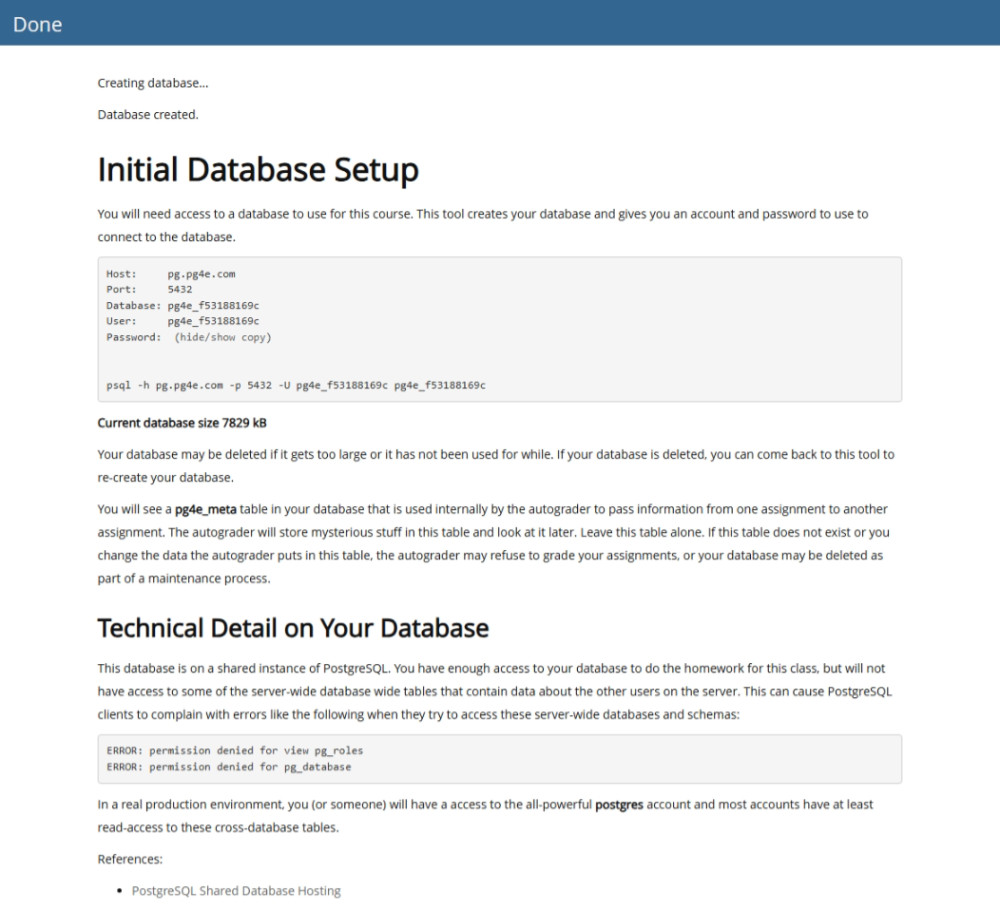
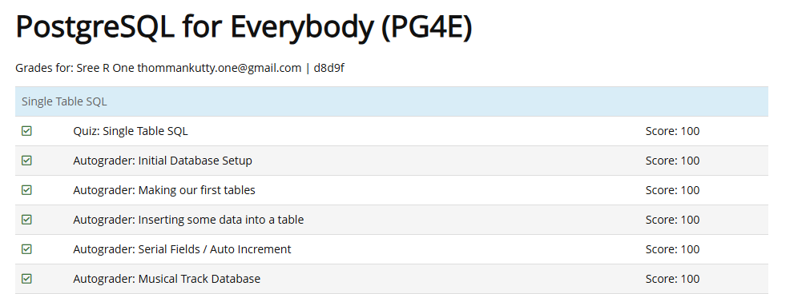

# History of Relational Databases

NIST : National Institure of Standard of Technology
Elizabeth Fong

SQL is non procedural - It focuses on the results rather than the procedures

The critical part of the database is called CRUD - Create - Read - Update - Delete

Data is modelled as a network

SQL Server - Microsoft
MySQL - Bought by Oracle
Oracle - Gold Standard, most difficult
Postgres - Open Source

# Elizabeth Fong: Creating the SQL Database Standards

There were multiple databases from multiple vendors

Elizabeth Fong

Metadata is also called as the Schema

# Operations

## INSERT

```bash
INSERT INTO tablename (columns..) VALUES (values);

INSERT INTO users (name, email) VALUES ('name','example@gmail.com');
```

## UPDATE

```bash
UPDATE users SET name='Sreeraj' WHERE email='sreeraj_ec@hotmail.com';
```

> Always include `WHERE` otherwise it will update the entire table

## DELETE

```bash
DELETE FROM tablename WHERE value='value';

DELETE FROM users WHERE email='example@gmail.com';
```

## SELECT

```bash
# Basic
SELECT * FROM tablename;

SELECT * FROM users;
SELECT * FROM users WHERE email='example@gmail.com';
```

## ORDER BY

```bash
SELECT * FROM users ORDER BY email;
SELECT * FROM users ORDER BY email DESC;
```

> It is Ascending by default. Use ASC or DESC for sorting

## LIKE and Wildcards

```bash
SELECT * FROM WHERE name LIKE 'pattern-to-find';
SELECT * FROM users WHERE email LIKE '%gmail.com%';
```

## LIMIT and OFFSET for Pagination

```bash
SELECT * FROM users ORDER BY email LIMIT 2 OFFSET 5;
```

> This is for optimising the performance

## COUNT

```bash
SELECT  COUNT(*) FROM tablename;
SELECT  COUNT(*) FROM users;
```

## Summary

- SQL is not procedural: no loops or if statements, but commands behave like loops internally.
- SQL is an abstraction: You don’t need to know how the data is physically accessed.
- It was designed to be simple and powerful

# PostgreSQL Data Types

This document summarizes key concepts about PostgreSQL data types including text, numeric, binary, and date/time types — with design guidance and performance tips.

## Character Data Types

| Type         | Description                                         | Use When...                                          |
| ------------ | --------------------------------------------------- | ---------------------------------------------------- |
| `VARCHAR(n)` | Variable-length string (up to `n` characters)       | You want length limits but don’t know the exact size |
| `CHAR(n)`    | Fixed-length string (always exactly `n` characters) | You always store fixed-size data (e.g. SHA256 hash)  |
| `TEXT`       | Unlimited-length string                             | For large bodies of text (e.g. comments, blogs)      |

Avoid using `TEXT` in `WHERE`, `ORDER BY`, or indexes — use `VARCHAR` instead.

## Character Sets (Encoding)

- All string types support UTF-8 (multi-language/Unicode).
- Important for sorting, comparisons, and non-English input.
- Sorting rules depend on the character set (locale-aware).

## Binary Data

| Type    | Description                      | Use Case                    |
| ------- | -------------------------------- | --------------------------- |
| `BYTEA` | Stores binary data (byte arrays) | Images, files, or raw blobs |

Not suitable for text or searching. Can’t use character set–based operations.

## Numeric Types

| Type               | Size      | Description                            | Use When...                     |
| ------------------ | --------- | -------------------------------------- | ------------------------------- |
| `SMALLINT`         | 16-bit    | -32K to 32K                            | Space-saving for tiny numbers   |
| `INTEGER` / `INT`  | 32-bit    | ±2 billion                             | Default for IDs and counts      |
| `BIGINT`           | 64-bit    | Very large numbers                     | For huge counters or timestamps |
| `REAL`             | 32-bit FP | ~7 digits accuracy (approximate float) | Weather, sensor data            |
| `DOUBLE PRECISION` | 64-bit FP | ~15 digits accuracy (scientific float) | Simulations, calculations       |
| `NUMERIC(p,s)`     | Arbitrary | Exact decimal precision                | Use this for money and currency |

`NUMERIC(14,2)` = 14 digits total, 2 after the decimal point.

## Date & Time Types

| Type        | Description                   | Use Case                 |
| ----------- | ----------------------------- | ------------------------ |
| `DATE`      | Calendar date only            | Birthdays, deadlines     |
| `TIME`      | Time of day only              | Appointments             |
| `TIMESTAMP` | Date + time (64-bit, precise) | Most general-purpose use |

PostgreSQL uses 64-bit timestamps — no Year 2038 bug. Can represent time from 4713 BC to 294276 AD.

## Design Tips

- Use `VARCHAR` unless you’re absolutely sure the length is fixed → then use `CHAR(n)`.
- Use `TEXT` for unbounded user content (blog posts, comments).
- Don’t use `REAL` or `DOUBLE` for money — use `NUMERIC(p,s)` instead.
- Avoid indexing or filtering on `TEXT` or `BYTEA` without special consideration.
- Use UTF-8 to support multilingual input.

## Quick Reference Table

| Category   | PostgreSQL Type  | Notes                           |
| ---------- | ---------------- | ------------------------------- |
| Text       | `VARCHAR(n)`     | Most flexible string type       |
| Fixed Text | `CHAR(n)`        | Best for fixed-size hashes/IDs  |
| Long Text  | `TEXT`           | Avoid for indexing              |
| Binary     | `BYTEA`          | Use for blobs, images           |
| Integers   | `INT`, `BIGINT`  | Default for IDs/counts          |
| Floats     | `REAL`, `DOUBLE` | For approximate scientific data |
| Money      | `NUMERIC(p,s)`   | Always use for currency         |
| Dates      | `TIMESTAMP`      | Most versatile date-time type   |

# Setup of the database

The connection was added succesfully and Data was inserted successfully.



The first (and easy) part was completed

